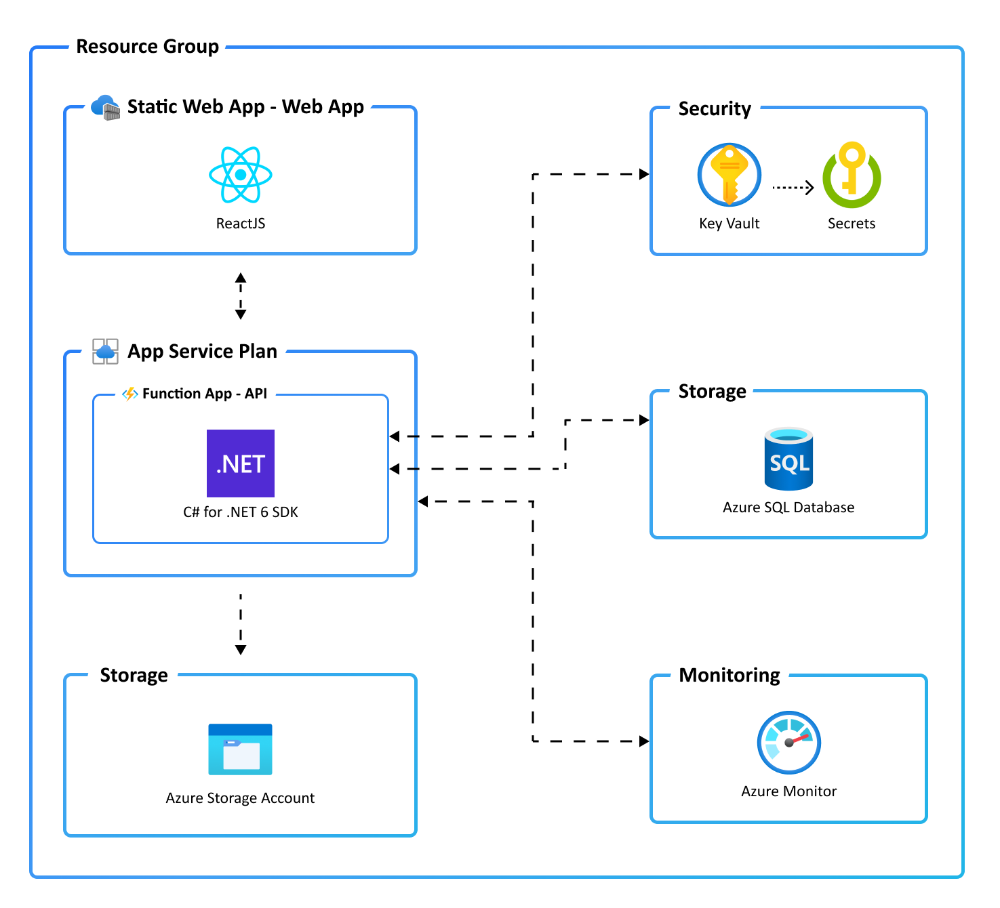

# Static React Web App + Functions with C# API and SQL Database on Azure

[](https://codespaces.new/azure-samples/todo-csharp-sql-swa-func)
[](https://vscode.dev/redirect?url=vscode://ms-vscode-remote.remote-containers/cloneInVolume?url=https://github.com/azure-samples/todo-csharp-sql-swa-func)

A blueprint for getting a React web app with a C# API and a SQL database running on Azure following core functional practices. The blueprint includes sample application code (a ToDo web app) which can be removed and replaced with your own application code. Add your own source code and leverage the Infrastructure as Code assets (written in Terraform) to get up and running quickly. This architecture is for hosting static web apps with serverless logic and functionality.

The architecture to following infrastructure and DevOps practice

- Use AZD tooling and solution structure conventions
- Configuration of Terraform backend state
- Configuration that enables each product to service to register themselves with a share Terraform state storage account. Each Product or Services and their own environment remain independent
- Helper scripts which enable `terraform validate` and `terraform plan` to be run locally whilst maintain AZD configuration
- Helper script which create a Agg Registration, Service Principle and Federated Credentials which can be used by deployment pipelines for a secure / secretless configuration

### Prerequisites
>
> This template will create infrastructure and deploy code to Azure.

The following prerequisites are required to use this application. Please ensure that you have them all installed locally.

- [Azure Developer CLI](https://aka.ms/azd-install)
- [.NET SDK 6.0](https://dotnet.microsoft.com/download/dotnet/6.0) - for the API backend
- [Azure Functions Core Tools (4+)](https://docs.microsoft.com/azure/azure-functions/functions-run-local)
- [Node.js with npm (16.13.1+)](https://nodejs.org/) - for the Web frontend

### One Time Configuration
>
> The following are the step required to configure your Azure environment, assumed to be an empty subscription. 

The following scripts needs to be run under the context of the owner of the subscription. 
The scripts that set up the environments use the settings stored in AZD's infra environment configuration, `.azure/infra/.env` by default.  Ensure the following settings are set are necessary

| Settings | Description |
|---|---|
| AZURE_TENANT_ID | Identifies the Azure Tenant |
| AZURE_SUBSCRIPTION_ID | Identifies the Azure Subscription |
| RS_RESOURCE_GROUP | Identifies the Resource Group in which the Terraform storage account will be provisioned.  If using Terraform for other resource groups in your subscription you should consider using a unique one here,  eg not one managed by Terraform itself. |
| RS_STORAGE_ACCOUNT | The name of the storage account.  |
| RS_CONTAINER_NAME | The container that this product or service will used for its Terraform state.  This patterns enables multiple products or services to share a storage account without interfering with each other |                                                |                                                |

Create the Terraform Backend
```bash
# From the project root
cd scripts

# Give all scripts execute permissions
chmod +x *.sh

# Provision the Terraform backend
./provision-terraform-backend.sh
```

### Quickstart

To learn how to get started with any template, follow the steps in [this quickstart](https://learn.microsoft.com/azure/developer/azure-developer-cli/get-started?tabs=localinstall&pivots=programming-language-csharp) with this template(`Azure-Samples/todo-csharp-sql-swa-func`).

This quickstart will show you how to authenticate on Azure, initialize using a template, provision infrastructure and deploy code on Azure via the following commands:

```bash
# Log in to azd. Only required once per-install.
azd auth login

# First-time project setup. Initialize a project in the current directory, using this template. 
azd init --template Azure-Samples/todo-csharp-sql-swa-func

# Provision and deploy to Azure
azd up
```

### Application Architecture

This application utilizes the following Azure resources:

- [**Azure Static Web Apps**](https://docs.microsoft.com/azure/static-web-apps/) to host the Web frontend
- [**Azure Function Apps**](https://docs.microsoft.com/azure/azure-functions/) to host the API backend
- [**Azure SQL**](https://learn.microsoft.com/azure/azure-sql/database/sql-database-paas-overview?view=azuresql/) for storage
- [**Azure Monitor**](https://docs.microsoft.com/azure/azure-monitor/) for monitoring and logging
- [**Azure Key Vault**](https://docs.microsoft.com/azure/key-vault/) for securing secrets

Here's a high level architecture diagram that illustrates these components. Notice that these are all contained within a single [resource group](https://docs.microsoft.com/azure/azure-resource-manager/management/manage-resource-groups-portal), that will be created for you when you create the resources.



> This template provisions resources to an Azure subscription that you will select upon provisioning them. Please refer to the [Pricing calculator for Microsoft Azure](https://azure.microsoft.com/pricing/calculator/) and, if needed, update the included Azure resource definitions found in `infra/main.bicep` to suit your needs.

### Application Code

This template is structured to follow the [Azure Developer CLI](https://aka.ms/azure-dev/overview). You can learn more about `azd` architecture in [the official documentation](https://learn.microsoft.com/azure/developer/azure-developer-cli/make-azd-compatible?pivots=azd-create#understand-the-azd-architecture).

### Next Steps

At this point, you have a complete application deployed on Azure. But there is much more that the Azure Developer CLI can do. These next steps will introduce you to additional commands that will make creating applications on Azure much easier. Using the Azure Developer CLI, you can setup your pipelines, monitor your application, test and debug locally.

- [`azd pipeline config`](https://learn.microsoft.com/en-us/azure/developer/azure-developer-cli/configure-devops-pipeline?tabs=GitHub) - to configure a CI/CD pipeline (using GitHub Actions or Azure DevOps) to deploy your application whenever code is pushed to the main branch.

- [`azd monitor`](https://learn.microsoft.com/en-us/azure/developer/azure-developer-cli/monitor-your-app) - to monitor the application and quickly navigate to the various Application Insights dashboards (e.g. overview, live metrics, logs)

- [Run and Debug Locally](https://learn.microsoft.com/en-us/azure/developer/azure-developer-cli/debug?pivots=ide-vs-code) - using Visual Studio Code and the Azure Developer CLI extension

- [`azd down`](https://learn.microsoft.com/en-us/azure/developer/azure-developer-cli/reference#azd-down) - to delete all the Azure resources created with this template

- [Enable optional features, like APIM](./OPTIONAL_FEATURES.md) - for enhanced backend API protection and observability

### Additional `azd` commands

The Azure Developer CLI includes many other commands to help with your Azure development experience. You can view these commands at the terminal by running `azd help`. You can also view the full list of commands on our [Azure Developer CLI command](https://aka.ms/azure-dev/ref) page.

## Security

### Roles

This template creates a [managed identity](https://docs.microsoft.com/azure/active-directory/managed-identities-azure-resources/overview) for your app inside your Azure Active Directory tenant, and it is used to authenticate your app with Azure and other services that support Azure AD authentication like Key Vault via access policies. You will see principalId referenced in the infrastructure as code files, that refers to the id of the currently logged in Azure Developer CLI user, which will be granted access policies and permissions to run the application locally. To view your managed identity in the Azure Portal, follow these [steps](https://docs.microsoft.com/azure/active-directory/managed-identities-azure-resources/how-to-view-managed-identity-service-principal-portal).

### Key Vault

This template uses [Azure Key Vault](https://docs.microsoft.com/azure/key-vault/general/overview) to securely store your Azure SQL connection string for the provisioned Azure SQL Database. Key Vault is a cloud service for securely storing and accessing secrets (API keys, passwords, certificates, cryptographic keys) and makes it simple to give other Azure services access to them. As you continue developing your solution, you may add as many secrets to your Key Vault as you require.

## Reporting Issues and Feedback

If you have any feature requests, issues, or areas for improvement, please [file an issue](https://aka.ms/azure-dev/issues). To keep up-to-date, ask questions, or share suggestions, join our [GitHub Discussions](https://aka.ms/azure-dev/discussions). You may also contact us via <AzDevTeam@microsoft.com>.

